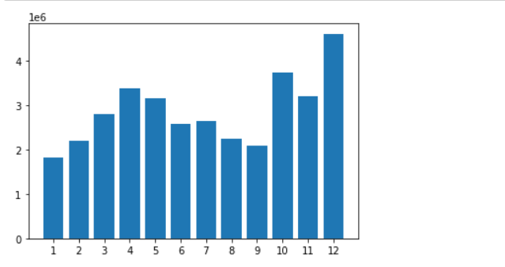
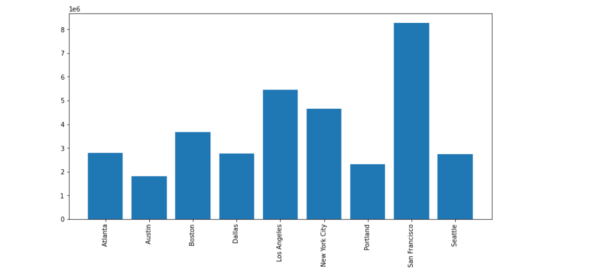
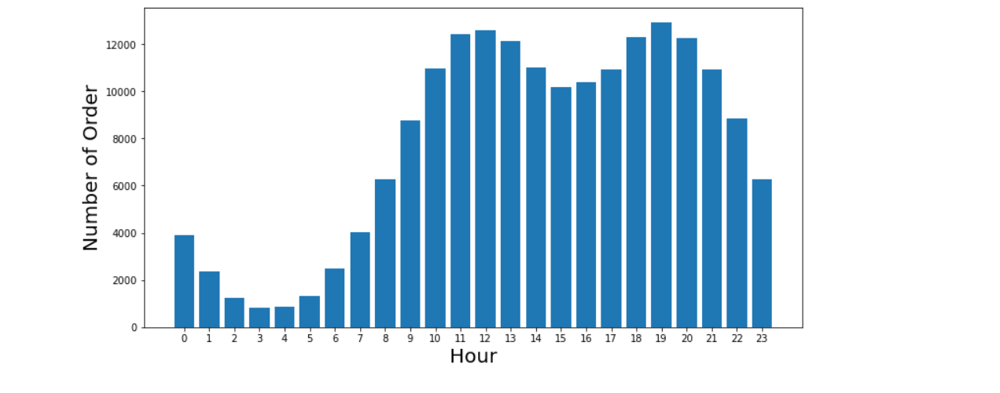
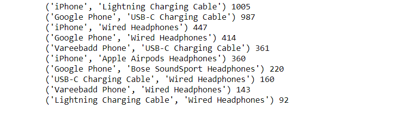
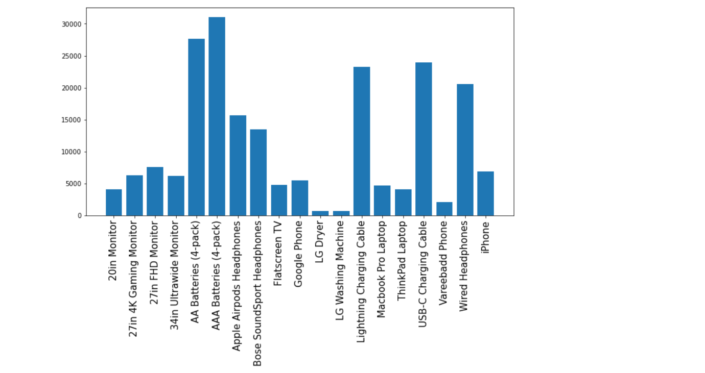
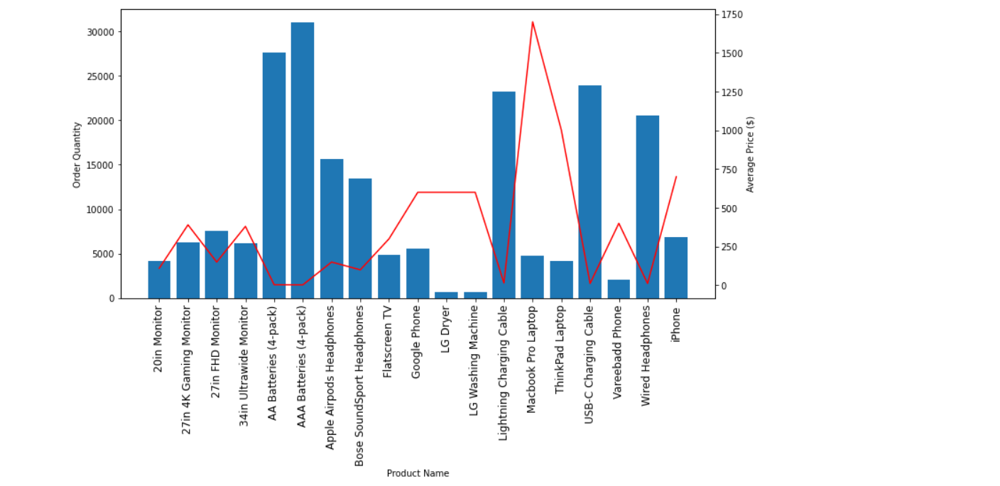

# sales_data_analysis

### Overview
This repository consists of 12 months of data analysis and some questions answers.

# Questions

### Question 1: What was the best month for sale? How much was earned that month?
The best month of sale was December and the earning amount was 4613443.

        

### Question 2: what city had the highest number of sell?
San Francisco had the highest number of sell.

### Question 3: what time should we display advertisements to maximize the likelihood of customers buying products?
My recommendation is around 12am (12) or 7pm (19)

### Question 4: What products are most often sold together?

### Question 5: What product sold the most? Why do you think it sold the most?
The most sold product is AAA Batteries (4-pack)

##### When the prices of the products are comparatively low, products are sold high.

